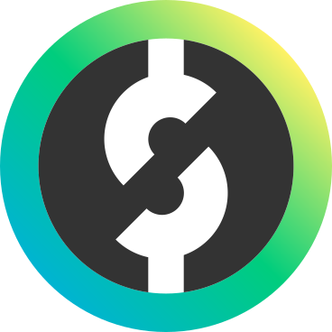
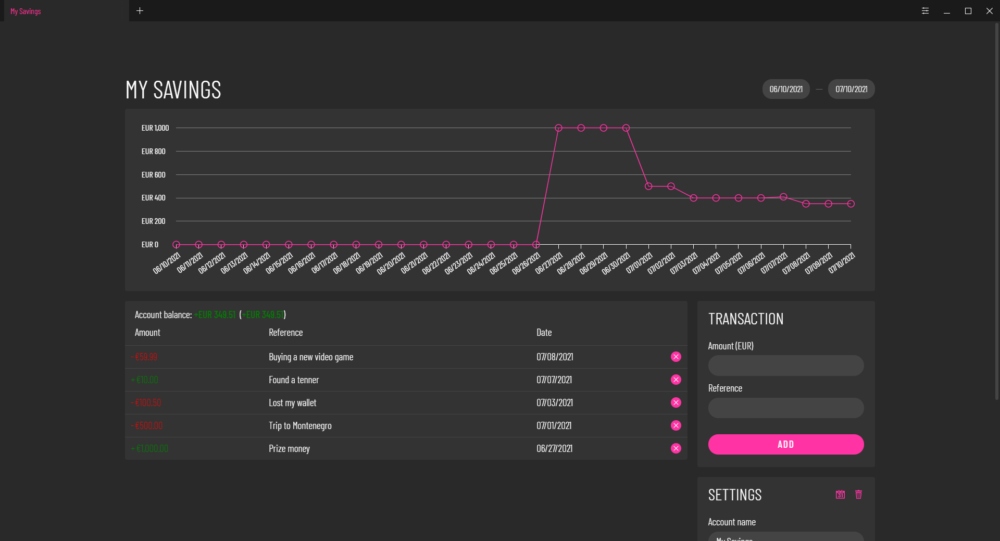
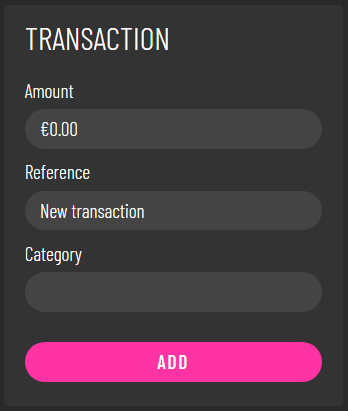
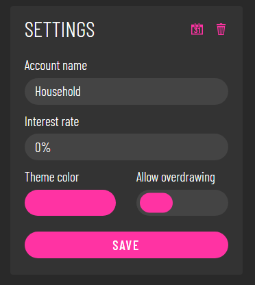
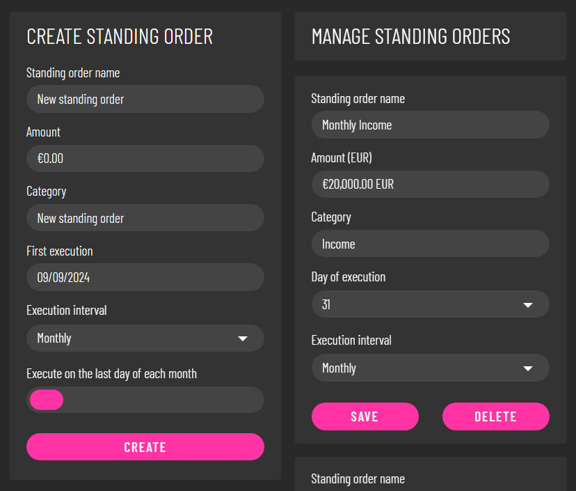
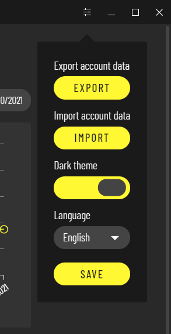
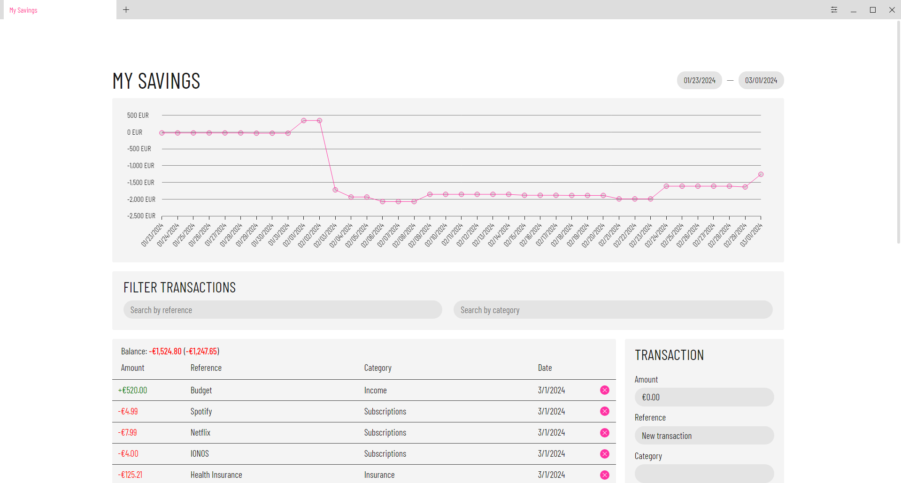
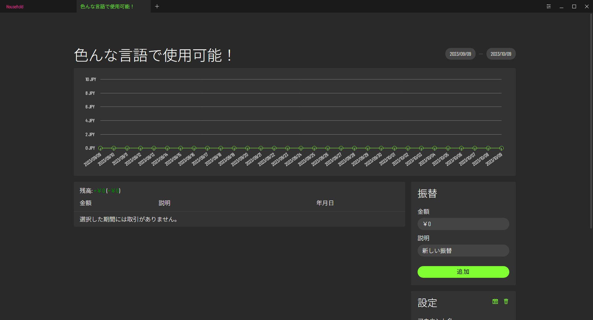

# Open Source Ledger Oslo
Oslo (formerly known as Spectrum) is a program that helps you manage your savings by letting you create virtual savings accounts. 
It also allows you to set up standing orders, change its appearance, import/export accounts and many other things. 
Keep in mind that Oslo is not a banking app. It is simply a way for you to keep track of your savings. 
Your account data is saved locally in a SQLite database, so don't use Oslo for any sensitive information.
<br><br>
## Installation
### Windows
Installation on Windows is extremely easy. You just download the setup and run it.
The Windows distribution uses Squirrel.
### Linux (RPM)
If you are using a redhat distro like Fedora, download the .rpm and run:
```
sudo rpm -i /path/to/package.rpm
```
### Linux (DEB)
If you are using a debian distro like Ubuntu, download the .deb and run:
```
sudo apt install /path/to/package.deb
```
### Building From Source (Other Platforms)
If your platform is not part of the official releases, you can still use Oslo.
You will need the following things:
- Git
- NPM (or another package manager)
First clone the repo:
```
git clone https://github.com/konstantin-lukas/oslo.git
```
Then navigate to the repo and install dependencies:
```
cd oslo
npm install
```
Write a maker config inside `forge.config.ts`.
As you can see it already contains some configurations for Windows and Linux. If you wanted
to build for macOS, you would use `@electron-forge/maker-dmg`. You can find more information
on makers [here](https://www.electronforge.io/config/makers).
After configuring, you need to run
```
npm run package
```
and when that is done
```
npm run make
```
There will be a make directory inside the output folder which contains your finished build
which you can install with whichever means your platform uses.
## Main UI
<br><br>
The browser-like navigation bar at the top is for creating new savings accounts and switching between them. The currently selected tab is referred to as the active account. The graph at the top of every account shows you the account balance for the time span you have selected. Below that on the left, you can see the changes made during that time span in a table. In the table header you can find your total account balance and in parentheses the balance change for the selected time span.
## Side Menu
<br><br>
This menu allows you to make basic transaction like adding money to an account or withdrawing it by simply by creating a transaction with a negative amount.
<br><br><br><br>
Each account has its own name and theme color to tell it apart from other accounts. You can also set whether the balance can go below zero and set up an interest rate. The interest rate is added to your account annually if larger than 0 percent.
## Standing Orders
<br><br>
In this menu which can be accessed by clicking the calendar icon in the settings menu of an account, you can manage standing orders for the active account. Standing orders are particularly useful if you have to make recurring payments, or you want to give yourself a monthly allowance. You can use the menu on the left side to create a new standing order or manage the existing ones on the right side.
## Settings
<br><br>
By clicking the icon next to the window resize options you can adjust Oslo's global settings. Here you can also export or import account data, for example when moving to a different device.
## Light Mode
<br><br>
Oslo is in dark mode by default. If you do want a light theme, you can activate it in the global settings.
## Languages
<br><br>
Oslo is currently available in these 5 languages:
- English
- French
- German
- Japanese
- Spanish