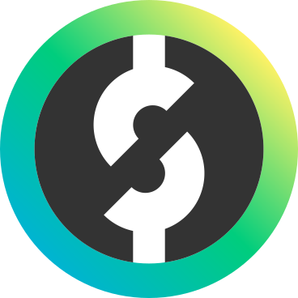
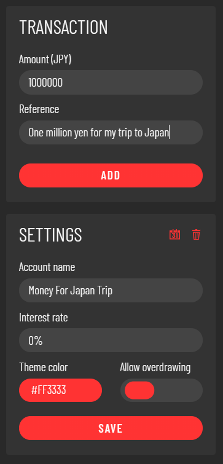

# Open Source Ledger Oslo
Oslo is a program that helps you manage your savings by letting you create virtual savings accounts. 
It also allows you to set up standing orders, change its appearance, import/export accounts and many other things. 
Keep in mind that Oslo is not a banking app. It is simply a way for you to keep track of your savings. 
Your account data is saved locally in a SQLite database, so don't use Oslo for any sensitive information.
  

## Main UI
  
The browser-like navigation bar at the top is for creating new savings accounts and switching between them. The currently selected tab is referred to as the active account. The graph at the top of every account shows you the account balance for the time span you have selected. Below that on the left, you can see the changes made during that time span in a table. In the table header you can find your total account balance and in parenthesis the balance change for the selected time span.
## Side Menu
  
This menu which can be found on the right side below the balance chart is used for two things. The upper part labeled "transaction" is for depositing or withdrawing money from the active account. The lower part is for changing an accounts settings. If you click the trash can icon you can delete an account. If you click the calendar icon, you can set up and manage standing orders for the active account.
### Interest rate
This percentage is multiplied with your account balance at the end of every year and the resulting sum is added to your account.
### Theme color
Setting different theme colors for your account makes it easier to tell them apart quickly and also allows you to customize Spectrum to your liking.
### Overdrawing
Oslo allows you to decide whether you want to allow overdrawing. If enabled, an account's balance is unable to go below 0.
## Standing Orders
  
In this menu which can be accessed by clicking the calendar icon in the settings menu of an account, you can manage standing orders for the active account. Standing orders are particularly useful if you have to make recurring payments or you want to give yourself a monthly allowance. You can use the menu on the left side to create a new standing order or manage the existing ones on the right side.
## Settings
  
By clicking the icon next to the window resize options you can adjust Oslo's global settings. Here you can also export or import account data, for example when updating to a newer version.
## Light Mode
  
Oslo is in dark mode by default. If you do want a light theme, you can activate it in the global settings.
## Languages
  
Oslo is currently available in 5 languages. Currently available are English, German, Spanish, French, and Japanese.
Here's a guide for adding new languages: TODO
